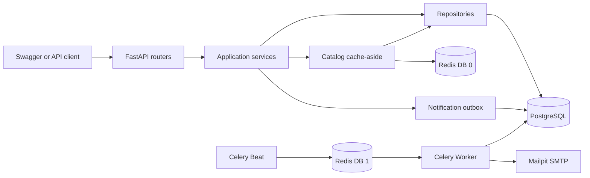

# FastAPI Hotel Booking

[](https://github.com/ArtemYuditskiy/fastapi-booking-hotels/actions/workflows/ci.yml)

An API-only hotel catalog and reservation service built with FastAPI,
PostgreSQL, Redis, and Celery. The project focuses on explicit business logic,
safe concurrent booking, resilient infrastructure integration, and a
reproducible local environment.

Swagger UI is the only user interface. Hotel and room data belongs to the local
PostgreSQL catalog; the API does not proxy an external hotel provider.

## Features

- OAuth2 password flow with Bearer JWT authentication;
- an idempotently seeded catalog of 12 hotels and 31 room types;
- availability search by city, dates, and USD price range;
- reservation holds with confirmation, cancellation, and expiration;
- PostgreSQL row locking that prevents inventory overselling;
- Redis cache-aside reads with a PostgreSQL fallback;
- Celery Worker and Beat workflows for expiration and email delivery;
- a transactional notification outbox and local Mailpit inbox;
- request-aware JSON logs;
- Alembic migrations and an isolated PostgreSQL test database;
- CI checks for formatting, linting, types, migrations, tests, and coverage.

## Architecture



HTTP concerns stay in routers, business decisions live in services, and
repositories contain database queries. Services own transaction boundaries;
repositories flush changes when necessary but never commit independently.

Redis uses separate logical databases for the catalog cache and Celery broker.
It is never the source of hotel, inventory, booking, or notification data.

## Booking and availability rules

A room type describes a shared inventory pool through its `quantity`. Dates use
the half-open interval `[date_from, date_to)`, so a new guest may check in on the
previous guest's checkout date.

```text
created ──> confirmed ──> cancelled
   │
   └──────> expired
```

- Creating a booking places a 15-minute `created` hold.
- `created` holds that have not expired and `confirmed` bookings occupy rooms.
- Cancelled, expired, and time-expired holds do not occupy rooms.
- Confirmation and cancellation are idempotent.
- A booking owned by another user is returned as `404`.
- A stay may contain at most 30 nights and cannot start in the past.

Reservation creation locks the selected `RoomType` row with
`SELECT FOR UPDATE`. The overlap count and insert then run in the same database
transaction. Concurrent requests for one inventory pool are serialized, so
successful bookings cannot exceed `RoomType.quantity`.

All money is stored and calculated with `NUMERIC` and Python `Decimal`. The only
supported currency is `USD`; a booking stores its own price snapshot so later
catalog changes cannot alter its total.

## Data model

| Model | Purpose |
| --- | --- |
| `User` | Authentication identity and Argon2 password hash |
| `Hotel` | Locally owned hotel details and services |
| `RoomType` | USD nightly price, quantity, and shared room inventory |
| `Booking` | Dates, price snapshot, owner, status, and hold deadline |
| `Notification` | Transactional outbox record and delivery state |

## Quick start with Docker Compose

Requirements:

- Docker Engine with Docker Compose;
- free host ports `8000`, `5432`, `6379`, `1025`, and `8025` by default.

Create local configuration and start the complete stack:

```bash
cp .env.example .env
docker compose up --build --wait
```

The one-shot `setup` service waits for PostgreSQL and Redis, applies every
Alembic migration, seeds the catalog, and invalidates catalog cache keys. API,
Worker, and Beat start only after setup exits successfully. Re-running the
command updates seed values without creating duplicates.

Available local services:

| Service | URL or port |
| --- | --- |
| Swagger UI | <http://localhost:8000/docs> |
| OpenAPI schema | <http://localhost:8000/openapi.json> |
| Health check | <http://localhost:8000/health> |
| Mailpit inbox | <http://localhost:8025> |
| PostgreSQL | `localhost:5432` |
| Redis | `localhost:6379` |

Inspect the stack and follow application logs:

```bash
docker compose ps -a
docker compose logs -f api worker beat
```

Stop containers while preserving the PostgreSQL volume:

```bash
docker compose down
```

Reset all local database data and rebuild from migrations and seed:

```bash
docker compose down --volumes --remove-orphans
docker compose up --build --wait
```

The first command permanently removes the local development and test databases.

Host ports can be changed in `.env` through `API_PORT`, `POSTGRES_PORT`,
`REDIS_PORT`, `SMTP_PORT`, and `MAILPIT_UI_PORT`. Container-to-container
database, Redis, and SMTP addresses are intentionally defined by Compose and do
not use host addresses from `.env`.

## API walkthrough

The examples below assume the Docker Compose stack is running.

### 1. Register

```bash
curl --request POST http://localhost:8000/api/v1/auth/register \
  --header "Content-Type: application/json" \
  --data '{
    "email": "traveler@example.com",
    "password": "correct-horse-battery-staple"
  }'
```

### 2. Obtain a Bearer token

OAuth2 uses `username` for the email because that field name is part of the
standard password form.

```bash
curl --request POST http://localhost:8000/api/v1/auth/token \
  --header "Content-Type: application/x-www-form-urlencoded" \
  --data-urlencode "username=traveler@example.com" \
  --data-urlencode "password=correct-horse-battery-staple"
```

Copy `access_token` from the response:

```bash
TOKEN="paste-access-token-here"
```

### 3. Search available hotels

Seed cities are Seattle, Austin, New York, and Miami.

```bash
curl "http://localhost:8000/api/v1/hotels?city=Seattle&date_from=2099-01-10&date_to=2099-01-13&min_price=100.00&max_price=300.00"
```

Each room option contains `room_type_id`, `rooms_left`, `price_per_night`,
`currency`, and `total_cost`. Search results are calculated from PostgreSQL and
are never cached because availability changes with time and bookings.

### 4. Create a reservation hold

Use a `room_type_id` returned by search:

```bash
curl --request POST http://localhost:8000/api/v1/bookings \
  --header "Authorization: Bearer $TOKEN" \
  --header "Content-Type: application/json" \
  --data '{
    "room_type_id": 1,
    "date_from": "2099-01-10",
    "date_to": "2099-01-13"
  }'
```

### 5. Confirm and receive a local email

Use the booking `id` returned by the previous request:

```bash
BOOKING_ID=1

curl --request POST \
  --header "Authorization: Bearer $TOKEN" \
  "http://localhost:8000/api/v1/bookings/$BOOKING_ID/confirm"
```

Confirmation commits the booking and one outbox row atomically. Beat dispatches
the notification ID, the Worker delivers it, and the message appears in Mailpit
at <http://localhost:8025>. SMTP downtime never rolls back a confirmed booking.

### 6. List or cancel bookings

```bash
curl --header "Authorization: Bearer $TOKEN" \
  http://localhost:8000/api/v1/bookings

curl --request DELETE \
  --header "Authorization: Bearer $TOKEN" \
  "http://localhost:8000/api/v1/bookings/$BOOKING_ID"
```

## Endpoint reference

```text
GET    /health

POST   /api/v1/auth/register
POST   /api/v1/auth/token
GET    /api/v1/auth/me

GET    /api/v1/hotels
GET    /api/v1/hotels/{hotel_id}
GET    /api/v1/hotels/{hotel_id}/rooms

GET    /api/v1/bookings
GET    /api/v1/bookings/{booking_id}
POST   /api/v1/bookings
POST   /api/v1/bookings/{booking_id}/confirm
DELETE /api/v1/bookings/{booking_id}
```

Swagger documents parameters, validation errors, and response schemas at
`/docs`.

## Background workflows

Celery Beat schedules two idempotent workflows:

- `bookings.expire_holds` persists due `created` holds as `expired`;
- `notifications.dispatch_pending` publishes due outbox IDs for delivery.

Correct availability does not depend on Beat running on time. Search and
reservation creation ignore a hold as soon as its `expires_at` deadline passes,
even before its status is persisted as `expired`.

Notification delivery uses a PostgreSQL claim lease. Parallel tasks cannot
deliver the same active claim, and work abandoned by a crashed Worker becomes
eligible after the claim timeout. Temporary failures use exponential backoff;
permanent SMTP rejection fails immediately.

Email delivery is at-least-once. A Worker crash after SMTP accepts a message but
before PostgreSQL records `sent` may produce a duplicate. Exactly-once delivery
would require a provider that accepts an idempotency key; plain SMTP does not.

## Local development with uv

Requirements:

- Python 3.12;
- [uv](https://docs.astral.sh/uv/);
- PostgreSQL and Redis, or their Compose services.

Install all locked dependency groups and start infrastructure:

```bash
cp .env.example .env
uv sync --locked --all-groups
docker compose up -d postgres redis mailpit
```

Apply migrations, seed the catalog, and run the API:

```bash
uv run alembic upgrade head
uv run python -m app.catalog.seed
uv run uvicorn app.main:app --reload
```

Run Worker and Beat in separate terminals:

```bash
uv run celery -A app.tasks.celery:celery worker --loglevel=INFO --concurrency=2
uv run celery -A app.tasks.celery:celery beat --loglevel=INFO
```

The PostgreSQL Compose init script creates both `hotel_booking` and
`hotel_booking_test` on a fresh volume. The application selects
`TEST_DATABASE_URL` only when `MODE=TEST`.

## Migrations and seed

Apply migrations and verify that models do not require a new migration:

```bash
uv run alembic upgrade head
uv run alembic check
```

Create a migration after an intentional model change:

```bash
uv run alembic revision --autogenerate -m "Describe schema change"
```

Always review autogenerated migrations before applying them.

The seed command performs PostgreSQL upserts by hotel slug and room type code:

```bash
uv run python -m app.catalog.seed
```

It updates known catalog records and never duplicates them. Seed and cache
invalidation are separate operations: a Redis failure is logged but does not
roll back catalog data already committed to PostgreSQL.

## Tests and quality checks

Start PostgreSQL and Redis before the full test suite:

```bash
docker compose up -d postgres redis
```

The test fixture drops and recreates only the `public` schema of
`hotel_booking_test`, then applies migrations from scratch. It refuses to run if
test and development database URLs are equal.

```bash
uv run pytest \
  --cov=app \
  --cov-report=term-missing \
  --cov-fail-under=80
```

Run the same static checks as CI:

```bash
uv run ruff check .
uv run ruff format --check .
uv run pyright
uv lock --check
```

The suite covers authentication, date validation, USD calculations, search
boundaries, concurrent inventory access, booking ownership and lifecycle,
Redis hit/miss/fallback/invalidation, hold expiration, outbox atomicity, SMTP
failure classification, and Celery retry behavior.

## Configuration

Pydantic Settings loads `.env` for processes started on the host. Important
variables are documented in `.env.example`.

| Variable | Purpose |
| --- | --- |
| `MODE` | Selects `DEV`, `TEST`, or `PROD` behavior |
| `DATABASE_URL` | Development PostgreSQL URL |
| `TEST_DATABASE_URL` | Isolated test PostgreSQL URL |
| `JWT_SECRET` | JWT signature secret, at least 32 characters |
| `REDIS_CACHE_URL` | Best-effort catalog cache |
| `CELERY_BROKER_URL` | Celery broker, separate Redis logical DB |
| `SMTP_HOST`, `SMTP_PORT` | Notification SMTP endpoint |
| `CATALOG_CACHE_TTL_SECONDS` | Reference-data cache lifetime |

The application refuses the built-in development JWT secret in `PROD`. JWTs,
passwords, and complete email addresses must not be logged.

## Logging and failure behavior

Application events are JSON and include a timestamp, level, event name, and
request ID where available. An incoming safe `X-Request-ID` is preserved;
otherwise the API creates one and returns it in the response header.

Expected degradation behavior:

- Redis cache failure: read from PostgreSQL and log `cache_unavailable`;
- empty hotel search: return `[]` and log `hotel_search_no_results`;
- SMTP failure: preserve the confirmed booking and retry the outbox record;
- delayed Beat: availability still ignores holds past their deadline;
- another user's booking: return `404` without disclosing its existence.

## Project structure

```text
app/
├── bookings/       reservation model, policy, repository, service, and tasks
├── catalog/        hotel catalog, search, cache-aside adapter, and seed
├── health/         lightweight application health endpoint
├── migrations/     Alembic environment and schema revisions
├── notifications/  transactional outbox, SMTP adapter, and delivery workflow
├── tasks/          Celery application and async database task bridge
├── tests/          unit, integration, API, and concurrency coverage
├── users/          registration, JWT authentication, and dependencies
├── config.py       validated environment settings
├── database.py     SQLAlchemy engine, metadata, and session dependency
├── logger.py       structured application logger and request context
└── main.py         FastAPI application, lifespan, routers, and middleware
```

## Scope and limitations

This project intentionally does not include:

- a frontend or server-rendered pages;
- a wallet, payment processing, or refunds;
- external hotel APIs or synchronization with third-party inventory;
- image upload or local static-file storage;
- an admin panel;
- multiple currencies;
- production SMTP credentials;
- exactly-once email delivery.

The API is designed as a focused backend portfolio project: PostgreSQL owns the
business state, Redis and Celery solve explicit infrastructure problems, and
Swagger provides a complete interactive interface.
